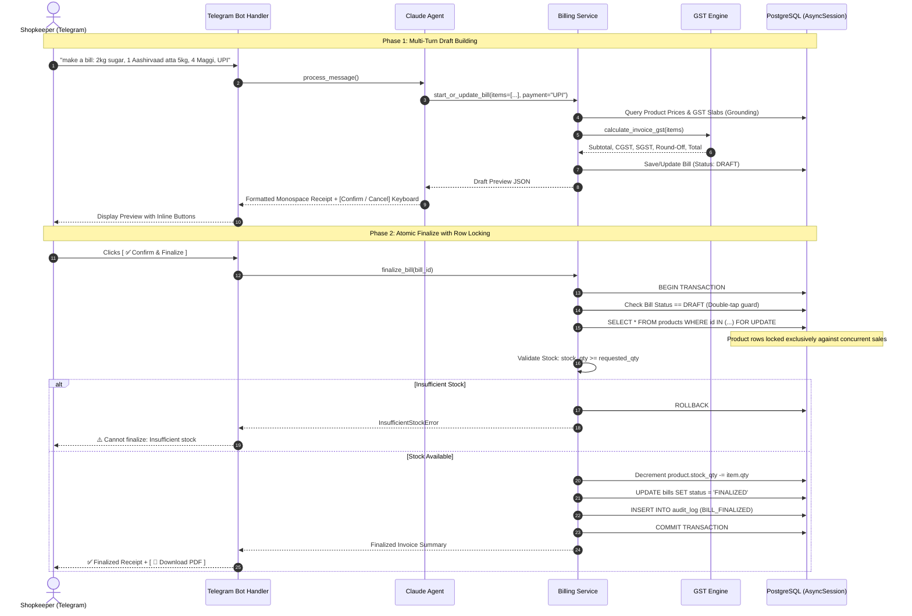
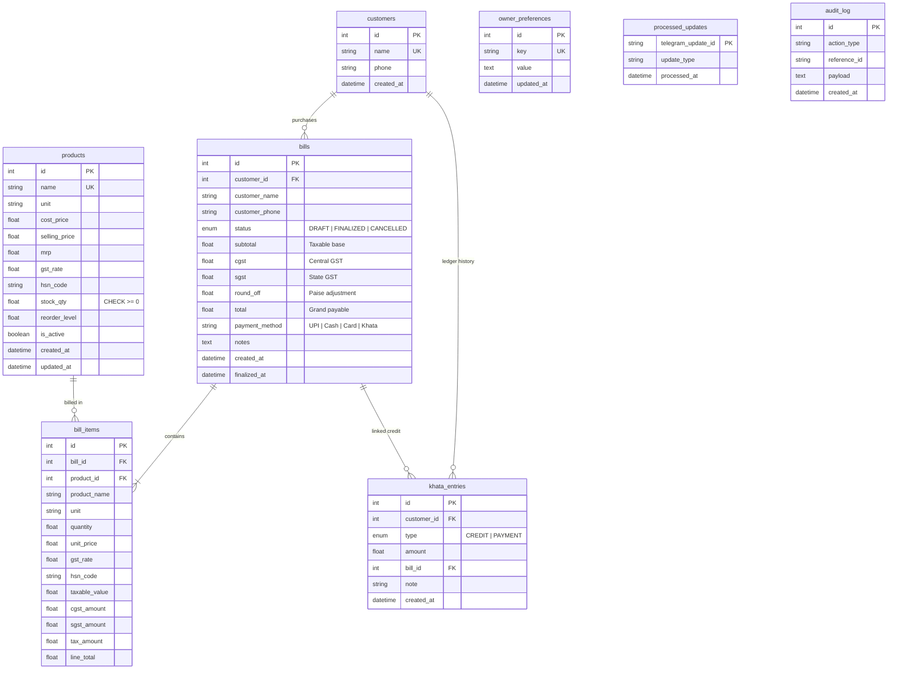

# Supermarket Ops Agent — System Architecture & Design Specification

> High-reliability, Telegram-first conversational AI agent for Indian kirana store operations. Built for the Nebula KnowLab Engineering evaluation.

---

## 1. System Architecture Diagram

```mermaid
flowchart TD
    subgraph TelegramClient["Telegram User Interface (No Web App / Forms)"]
        User["🏪 Kirana Shopkeeper (Natural Language)"]
        InlineBtn["🔘 Inline Callbacks [Confirm / Cancel / PDF]"]
    end

    subgraph BotLayer["Telegram Bot Harness (python-telegram-bot v21 Async)"]
        PTB["PTB Application / Dispatcher"]
        IdempGuard{"Idempotency Check\n(processed_updates)"}
        Formatter["Formatters & UI\n(MarkdownV2 Tables, Inline Keyboards)"]
    end

    subgraph AgentLayer["Claude Agent Harness (Observe-Reason-Act Loop)"]
        PromptBuilder["Dynamic System Prompt\n+ Owner Preferences Injection"]
        AgentLoop["Claude Agent Control Loop\n(Multi-Turn Tool Chaining)"]
        LLM["Anthropic Claude 3.5 / 3.7 Sonnet"]
        ToolReg["Pydantic Tool Registry\n(~16 Registered Tools)"]
    end

    subgraph ServiceLayer["Domain Services & Deterministic Business Rules"]
        InvSvc["Inventory Service\n(Oversell & Below-Cost Guard)"]
        BillSvc["Billing Service\n(Draft State Machine)"]
        GSTEngine["GST & Round-Off Engine\n(Pure Python Math)"]
        KhataSvc["Khata Ledger Service\n(Credit & Payment Math)"]
        AnalyticsSvc["Analytics Service\n(Pandas Aggregations)"]
        PrefSvc["Preferences Service\n(Persistent Memory)"]
        DocSvc["Document Generators\n(ReportLab PDF + python-pptx)"]
    end

    subgraph DataLayer["PostgreSQL Persistence (SQLAlchemy 2.0 Async + asyncpg)"]
        DB[(PostgreSQL Database\nRow-Level MVCC Locks)]
        ProductsTable[("products (stock >= 0)")]
        BillsTable[("bills & bill_items")]
        KhataTable[("customers & khata_entries")]
        PrefsTable[("owner_preferences")]
        AuditTable[("audit_log")]
        UpdateTable[("processed_updates")]
    end

    %% Connections
    User -->|Message| PTB
    InlineBtn -->|Callback Query| PTB
    PTB --> IdempGuard
    IdempGuard -->|New Update| AgentLoop
    IdempGuard -->|Duplicate Update| PTB

    AgentLoop <-->|Context & Tools| LLM
    PromptBuilder -->|System Prompt| AgentLoop
    PrefSvc --> PromptBuilder

    AgentLoop -->|Execute Tool| ToolReg
    ToolReg --> InvSvc & BillSvc & KhataSvc & AnalyticsSvc & PrefSvc & DocSvc

    BillSvc --> GSTEngine
    DocSvc --> ReportLab["ReportLab PDF Engine"]
    DocSvc --> PPTXEngine["python-pptx + Matplotlib"]

    InvSvc --> ProductsTable
    BillSvc -->|SELECT ... FOR UPDATE| ProductsTable
    BillSvc --> BillsTable
    KhataSvc --> KhataTable
    PrefSvc --> PrefsTable
    InvSvc & BillSvc & KhataSvc & PrefSvc --> AuditTable
    IdempGuard --> UpdateTable

    AgentLoop --> Formatter
    DocSvc -->|Generated Artifacts| Formatter
    Formatter -->|Rich Receipt / Document Attachment| User
```

---

## 2. Billing State Machine & Concurrency Sequence

---

## 3. Database Entity Relationship (ER) Diagram

